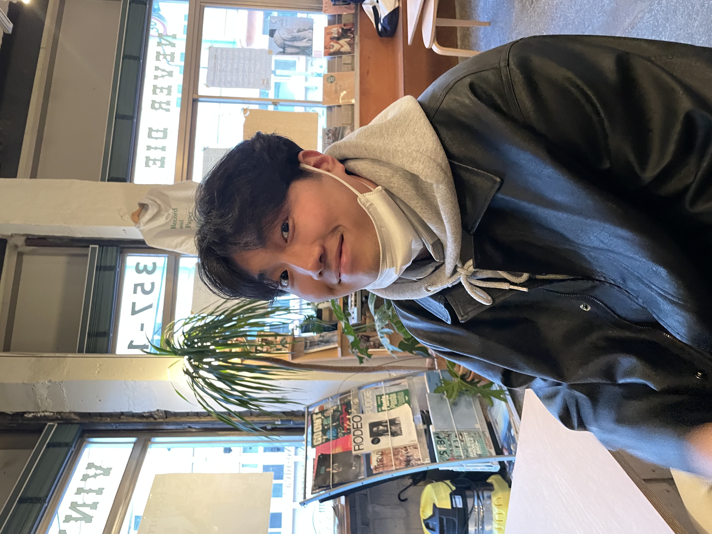
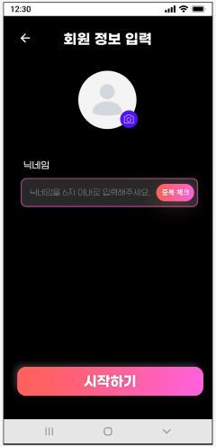
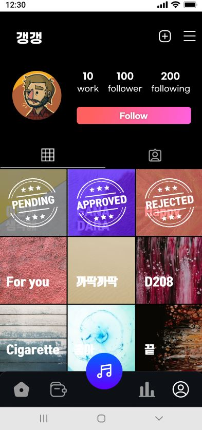

#  까딱까딱 프로젝트

### 목차

- [프로젝트 소개](#프로젝트-소개)
- [어벤저스 5인](#👩‍👩‍👧‍👧어벤져스-5인)
- [기술 스택 및 라이브러리](#⚙️-기술-스택-및-라이브러리)
- [주요 기능](#🤵-주요-기능)
- [아키텍처](#📐-아키텍처)
- [기술적 도전](#🔥-기술적-도전)

<br>

---


## 📜 프로젝트 소개


*`Web3.0 환경의 크리에이터 이코노미를 실현하다`*

개발 기간 : 2023.02.27 ~ 2023.04.07(7주)

```markdown

💡 까딱까딱 프로젝트는 음원 창작자의 저작권과 정당한 수익을 보장하는 "블록체인 기반 음원 스트리밍 안드로이드 서비스"입니다.

2022년 기준 세계 120조5000원 규모인 디지털 콘텐츠 시장의 급성장에 반해, "창작자들에게 불합리한 수익 배분 구조가 형성되어있다는 문제"를 인식했습니다.

이에 "블록체인의 무결성, 보안성, 투명성, 탈중앙화 특성을 활용"하여 "음원 창작자가 정당한 지적 재산권을 보장"받는 음원 스트리밍 서비스를 기획했습니다.

```

<br>


## 👩‍👩‍👧‍👧어벤져스 5인

### **Android**

|윤세림 | 홍민기 | 조민지 |
|:-:|:-:|:-:|
|||>|
|[@serim53](https://github.com/serim53)|[@hong0708](https://github.com/hong0708)|[@whalswl1126](https://github.com/whalswl1126)|

### **BackEnd**
| 이원일 | 권용준 |
|:-:|:-:|
|||
|[@WonilLee211](https://github.com/WonilLee211)|[@ubermen5che](https://github.com/ubermen5che)|


## ⚙️ 기술 스택 및 라이브러리

### Android


### Backend


<br>

## 🤵 주요 기능

> ### 로그인, 회원가입
> 카카오 로그인을 통해 회원가입이 가능합니다.
>
>
>

<br>

> ### 메인 페이지 및 음악 페이지
> 최신순 조회순 기준 업로드된 음원 목록을 볼 수 있습니다.
>
> 다양한 조건으로 음원, 창작자를 조회할 수 있습니다.
> 
> 
>
>
>


<br>

> ### 지갑 페이지
> 자체 발행한 KAT코인 잔액 조회, 충전, 전송, 거래 내역 등을 확인할 수 있습니다.
> 
> 충전를 활용하여 실제 코인을 구매할 수 있습니다.
>
>

<br>
 
> ### NFT
> 마켓페이지에서 유저가 판매중이거나 완료된 NFT 거래 목록을 볼 수 있습니다.
>
> NFT의 상세 조회는 블록체인에 저장된 정보를 추가된 정보를 볼 수 있습니다.
>
> KAT 코인으로 결제하여 NFT를 결제함으로써 소유권을 가질 수 있습니다.
>
> 보유한 NFT를 마이페이지에서 조회할 수 있습니다.
>
>

<br>

> ### 프로필 페이지
> 
> 프로필은 보유한 NFT 목록, 음악 플레이 히스토리, 구독, 팔로우/팔로잉 목록 조회, 업로드한 음원을 볼 수 있습니다.
> 
> 구독을 통해 해당 유저에게 직접 코인을 전송하게 됩니다.
>
> 구독한 가수에 대한 모든 음악 전체듣기가 가능합니다.
> 
> 업로드한 음원은 반려, 승인, 대기중 상태로 표시되며 승인 후 해당 음원에 대한 NFT를 생성할 수 있습니다.
>
>
>


<br>

## 🏗️ 아키텍처


백엔드  `API 서버`는 Spring boot를 이용하였고 `DB`는 MariaDB, 조회가 빈번한 데이터는 Redis에 저장했습니다.

 `Redis를 사용한 이유`는 요청 시 매번 반복되는 JWT 인증 과정에서 cache화 하여 반복되는 조회 요청을 줄이고자 함입니다.
 
  `서버는 멀티 모듈`로 API, Batch, Core 모듈로 구분하여 구성했습니다. 서비스 기획 상 batch가 필수적이었으며, 공용 클래스는 Core 모듈에 두어 공유했습니다. 이를 통해 개발 및 유지보수성을 높혔습니다. 
  
  운영 환경에 CI/CD를 위해 사용한 `Jenkins를 Docker로 관리`하며, `DooD 기술`을 적용하여 호스트 시스템에서 서버 컨테이너를 build하도록 설정했습니다. 이를 통해 호스트 환경의 Docker 성능과 보안성을 높혔습니다. 
  
  개발한 기능의 실행 안정성을 확보하기 위해 test code를 통해 서비스 검증했습니다. 
  
  NFT, 음원, Coin 보유량 등 `위변조가 불허되는 정보만을 블록체인에 저장`하도록 struct를 구성했습니다. 블록체인 네트워크에 배포된 컨트랙트의 함수를 사용하기 위해 서버와 안드로이드에서 wrapping된 class를 `Web3j` 라이브러리를 통해 사용하여 블록체인 네트워크와 통신했습니다.

<br>

## 🔥 기술적 도전

### 🧠 음원 유사도 검사 알고리즘 구현

    MFCC특징 추출 라이브러리를 이용해서 각 음악에 대한 MFCC(Mel-Frequency Cepstral Coefficient)특징 벡터를 추출하고, 음원 시계열 데이터에 대한 특징 벡터를 DTW(Dynamic Time Warping)알고리즘을 사용해서 두 음원간 유사도를 측정하였습니다. 

    DTW알고리즘은 동적계획법을 기반으로 하는데, 알고리즘을 직접 구현하여 실제 프로젝트에 적용해볼 수 있어서 유익한 경험이 되었습니다.

### 🧠 CompletableFuture를 활용한 비동기 처리

    음악업로드시 유사도 검증과정에서 모든 음악에 대해 유사도를 비교를 해야하기때문에 오랜시간이 소요되어 응답 지연이 발생하는 문제점이 있었습니다.

    이를 해결하기 위해 유사도 검사 상태정보를 저장하도록하고 CompletableFuture 라이브러리를 사용해서 유사도 검사 로직을 비동기로 처리하고, 상태정보를 변경하는 식으로 구현하여 응답지연을 최소화 하였습니다.

### 🧠 팔로우 목록 및 판매 목록 조회 쿼리 최적화

    1. 페이지네이션 적용에 따라 `offset 수가 커질수록 조회 성능이 저하되는 문제`가 있었습니다.
        - 500만 개 아이템을 바탕으로 테스트 시 최대 16초에서 최소 6초 이상의 응답시간이 소요됐습니다.
        - `커버링 인덱스`를 통해 클러스터 인덱스로 관리되는 필드로만 구성된 쿼리로 조회한 결과를 서브쿼리로 사용하여 페이지네이션의 offset을 대체했습니다.
    2. 쿼리 조건이 동적으로 변하였으며 여러 연관관계 정보가 추가된 목록 조회가 요구되었기에 `N+1 문제`가 해결되지 않았습니다.
        - 이에 JPQL로 작성했던 목록 조회 메서드를 Query DSL로 변경하여 조회 조건을 동적으로 입력했습니다. query DSL에 left join 조건을 추가하여 fetch 전략으로 N+1문제를 해결했습니다.

### 🧠 환전 기능에서 이중 지불, 결제 오류 문제 대응

    원화 결제 후 코인으로 환전하는 기능은 고객의 재산과 관련된 서비스이기 때문에 잘못된 요청에 의한 실행되면 안되는 서비스입니다.

    이에 따라 결제정보와 요청자 정보 등의 유효성과 대조를 통해 5 단계의 예외 처리를 통해 이중 지불과 결제 오류 가능성을 줄였습니다.

    하지만, Boot Pay와 blockchain, 두 독립적인 시스템과의 트랜잭션이 발생하기 때문에 ACID를 보장하지 못했다는 아쉬움이 남았습니다.